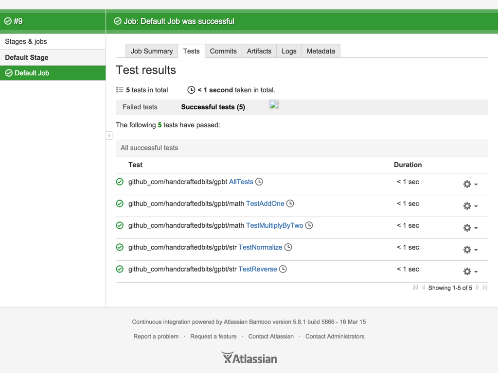

# Go Plugin for Bamboo Tutorial

- [Add the Go Capability](#add-the-go-capability)
- [Create the Build plan](#create-the-build-plan)
- [Configure Tasks](#configure-tasks)
  - [Source Code Checkout](#source-code-checkout)
  - [Go Dependency Fetcher](#go-dependency-fetcher)
- [Go Test Runner](#go-test-runner)
- [Go Test Parser](#go-test-parser)
- [Go Builder](#go-builder)
- [Examining Test results](#examining-test-results)

This tutorial will show you how to use Bamboo for Go projects by demonstrating its use for a simple Go tutorial project,
[gpbt](https://github.com/handcraftedbits/gpbt).  Note that tutorial assumes that a local agent will be used.  For
information on configuring remote agents, refer to the [user's guide](guide.md).

# Add the Go Capability

1. Make sure you are logged in to your Bamboo server as an administrator.
2. Click the administrator dropdown and select **Overview**.
3. Select **Server capabilities** from the left-hand side of the page.
4. Click the **Detect server capabilities** button in the upper right-hand corner of the page.
5. Since our server has both the `go` and `godep` executables installed and on the `PATH`, the Go Plugin for Bamboo was
able to detect their locations automatically.  The Go Plugin for Bamboo can also check for the executables if the
`GOROOT` and `GOPATH` environment variables are set.
  * If the Go Plugin for Bamboo is unable to detect the location of the `go` and `godep` executables, refer to the
  [user's guide](guide.md#manual-configuration).

# Create the Build plan

1. Make sure you are logged in to your Bamboo server as an administrator.
2. From the top menu bar, click the **Create** button and then **Create a new plan**.
3. Select **New Project** from the **Project** dropdown.
4. Enter the following information:
  * **Project name**: `Go Plugin for Bamboo Tutorial`
  * **Project key**: `GPBT`
  * **Plan name**: `Default`
  * **Plan key**: `DEF`
  * **Repository host**: Select **Link new repository**, click **Other**, then **GitHub**.
  * **Display name**: `gpbt_master`
  * **Username**: `handcraftedbits`
  * **Password**: leave empty
  * Click **Load Repositories**, then select `handcraftedbits/gpbt` from the **Repository** dropdown.
  * **Branch**: `master`
5. Click **Configure plan**.

# Configure Tasks

Now that the build plan has been created, we need to configure its build tasks.  We'll continue from the **Create a new
plan** wizard.

## Source Code Checkout

We need to make a small change to the default **Source Code Checkout** task Bamboo has set up for us.  By default,
Bamboo will clone the tutorial project's source directly to the build plan's working directory.  Since the Go Plugin for
Bamboo considers that directory the root of the Go project's `GOPATH`, we need to check out the tutorial source code to
a subdirectory consistent with Go standards.  Since the tutorial project is located at
`https://github.com/handcraftedbits/gpbt`, we need to check the source code out to the subdirectory `src/github.com/handcraftedbits/gpbt`:

1. Click **Source Code Checkout** on the left-hand side of the page.
2. Enter `src/github.com/handcraftedbits/gpbt` in the **Checkout Directory** text field.  This path will be used in
other build tasks.
3. Click the **Save** button.

## Go Dependency Fetcher

Our tutorial project has a dependency, and since we've configured it to use [Godep](https://github.com/tools/godep), the
Go Plugin for Bamboo's **Go Dependency Fetcher** task can run `godep` and fetch our project's dependencies for us.

1. Click the **Add task** button on the left-had side of the page.
2. Select **Go Dependency Fetcher** from the list of build tasks.
3. Enter the `GOROOT` for the `go` executable defined earlier in the **GOROOT** text field.  The Go Plugin for Bamboo
will attempt to set this value automatically: it will use the `GOROOT` environment variable if it is defined for the
Bamboo server or the parent directory of the `go` executable.  If the automatically determined value is not appropriate, you must fix it.
4. Enter `src/github.com/handcraftedbits/gpbt` in the **Source path** text field.

# Go Test Runner

Now we're going to have Bamboo run our Go project's tests.  We want to do this before the project is built and installed
because we want the build to fail right away if tests don't pass.

1. Click the **Add task** button on the left-had side of the page.
2. Select **Go Test Runner** from the list of build tasks.
3. Enter the `GOROOT` for the `go` executable defined earlier in the **GOROOT** text field.
4. Enter `src/github.com/handcraftedbits/gpbt` in the **Source path** text field.
5. In the **Packages to test** text area, leave the value as `./...` since we want to test all packages.  If you wanted
to test packages individually (for example, to specify flags that may not exist in other packages) you could, but in
general testing all packages at once is fine.

# Go Test Parser

Next, we will parse the test log output from the previous build task and turn it into native Bamboo test results:

1. Click the **Add task** button on the left-had side of the page.
2. Select **Go Test Parser** from the list of build tasks.
3. We can leave the **Go test result file pattern** text field alone since it uses the same default value as the
previous build task.

# Go Builder

Finally, we can build and install our Go project:

1. Click the **Add task** button on the left-had side of the page.
2. Select **Go Builder** from the list of build tasks.
3. Enter the `GOROOT` for the `go` executable defined earlier in the **GOROOT** text field.
4. Enter `src/github.com/handcraftedbits/gpbt` in the **Source path** text field.
5. In the **Packages to build** text area, leave the value as `./...` since we want to build and install all packages.
If you wanted to build packages individually you could, but in general building all packages at once is preferred.

Check the **Yes please!** checkbox under the **Enable this plan?** heading and click the **Create** button.

We should also add our compiled executable as an artifact of the build:

1. Select **Configure plan** from the **Actions** dropdown.
2. Click **Default Job**
3. Click the **Artifacts** tab.
4. Click the **Create definition** button.
5. Enter the following information:
  * **Name**: `gpbt Executable`
  * **Location**: `bin/`
  * **Copy pattern**: `gpbt`

Let's run the build plan by selecting **Run plan** from the **Run** dropdown.  After a few moments, you should see the
build succeed.  Congratulations, you've successfully tested and built a Go project using Bamboo!

# Examining Test results

Let's take a quick look at the test results for this build to better understand how the Go Plugin for Bamboo ties in to
Bamboo's native test reporting capabilities.  Click the **Tests** tab and then the **Default Job** link:

The Bamboo test results will look very much like the output of `go test` with a couple of differences:

* Bamboo doesn't allow periods in package names, so the Go Plugin for Bamboo will replace them with underscores; notice
how `github.com` becomes `github_com`.
* Whenever a package has no tests the Go Plugin for Bamboo will automatically create a test case called `AllTests`.
